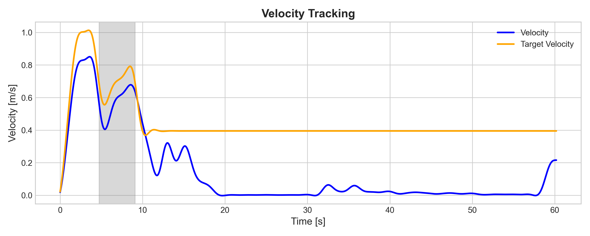
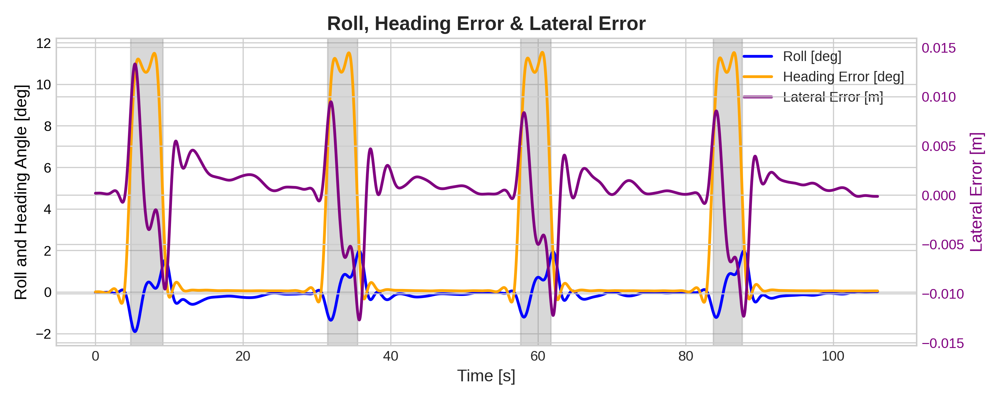
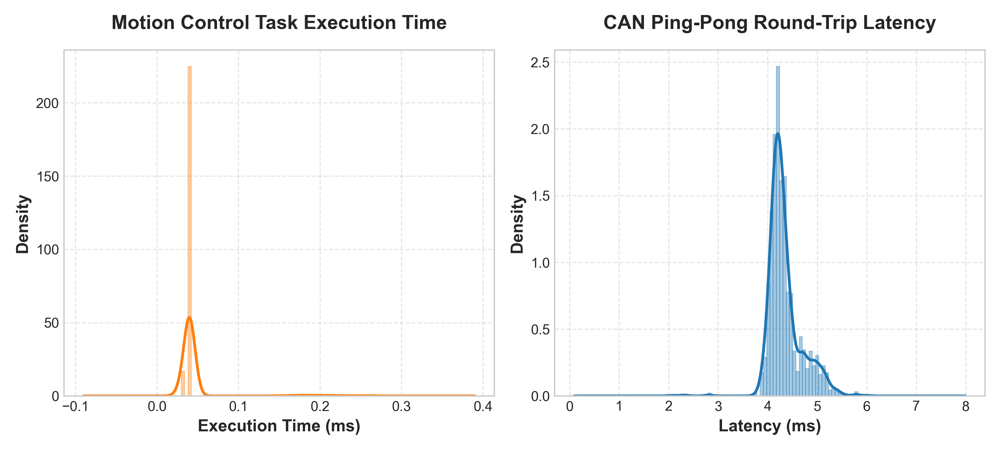

# 管道巡检机器人 (Pipe-Inspection Robot)

基于 ROS 2 + Ignition Gazebo + STM32F407 的四轮 Ackermann 管道巡检机器人项目，支持：

- **SIL（Software-in-the-Loop）**：纯仿真闭环控制（ROS 2 算法 + Gazebo 物理环境）
- **HIL（Hardware-in-the-Loop）**：仿真传感器经 CAN 总线驱动真实 STM32 固件控制器

> **说明**：本文件仅保留快速上手概要。完整架构、参数、CAN 映射、测试结果请见 `Explain.md`。

## 项目亮点

- 四轮 Ackermann 转向模型，支持封闭管道路径自主巡航。
- Python（ROS 2）与 C（STM32）控制逻辑参数对齐，便于 SIL/HIL 对照验证。
- 支持 ROS 2 ↔ SocketCAN ↔ STM32 的双向链路。
- **双模式仿真**：标准实时仿真 + 锁步精确仿真（支持 Gazebo 步进控制）。
- **完整测试工具**：包含 HIL 压力测试、CAN 通信模拟测试（`can_test.py`）和数据可视化工具。

## 关键测试数据与图表

### 1. 速度闭环控制
展示了机器人在巡检过程中纵向速度的闭环控制效果及目标速度的跟踪表现：


### 2. 位姿与姿态跟踪
展示了机器人在管道运动中的侧倾角(Roll)、航向角(Heading)及横向位置误差的实时控制状态：


### 3. HIL 压力测试评估
展示了硬件在环(HIL)模式下固件控制算法的整体响应时间和执行延迟压力：


## 环境依赖

### ROS 2 侧
- Ubuntu 22.04
- ROS 2 Humble（或兼容）
- Ignition Gazebo（Fortress 或兼容）
- `ros_gz_sim`、`ros_gz_bridge`、`rviz2`、`xacro`
- `python-can`、`ros2_socketcan`

### 固件侧
- ARM 交叉编译工具链：`gcc-arm-none-eabi`
- `cmake`（>= 3.22）
- `ninja-build`

## 快速开始

辅助脚本位于项目根目录。

### 1) 启动仿真器（SIL/HIL 通用第一步）

**标准仿真模式（实时运行）：**
```bash
bash sim.sh
```

**锁步仿真模式（精确步进控制）：**
```bash
bash ssim.sh
```

这些脚本会构建 `simple_car_sim` 并启动对应仿真环境（Gazebo + 机器人 + RViz）。

### 2) 启动控制节点（SIL 第二步）

**标准 SIL 模式：**
```bash
bash sil.sh
# 或
source install/setup.bash
ros2 launch simple_car_sim robot_system.launch.py
```

**单独运行控制节点：**
```bash
bash mil.sh
# 或
source install/setup.bash
ros2 run simple_car_sim autonomous_control.py --ros-args -p use_sim_time:=true
```

> SIL 需要以上两步同时运行：`sim.sh`（或 `ssim.sh`）+ `sil.sh`（或对应控制节点）。

### 3) 启动 HIL 通信与控制链路（HIL 第二步）

**HIL 模式（锁步控制，物理 CAN 接口）：**
```bash
# 第一步：启动锁步仿真器
bash ssim.sh
# 第二步：启动 HIL 通信与控制链路
bash hil.sh
```

**标准 SIL 模式（虚拟 CAN 接口）：**
```bash
# 第一步：启动标准仿真器
bash sim.sh
# 第二步：启动 SIL 控制链路
bash sil.sh
```

> HIL 模式使用锁步仿真和控制，通过物理 `can0` 接口与 STM32 通信。`hil.sh` 启动 `step_robot_system.launch.py`（`ros2_socketcan` + `can_transceiver.py` + `step_control.py`）。

> SIL 模式使用标准仿真和虚拟 `vcan0` 接口。`sil.sh` 启动 `robot_system.launch.py`（`ros2_socketcan` + `can_transceiver.py` + `autonomous_control.py` + RViz）。

> HIL 需要实际硬件（STM32 + CAN 设备，如 `can0`）。SocketCAN 配置、虚拟 CAN 测试与刷写流程请见 `Explain.md`。

## 文档说明

- `README.md`：概要与快速上手。
- `Explain.md`：详细系统设计、参数、通信协议、构建与测试说明。

## 许可证

MIT License，详见 `LICENSE`。
