这是一个基于你的 robot.urdf.xacro 文件生成的完整树形结构图。图表中包含了每个 Link 的几何形状（Geometry）以及连接它们的 Joint 的类型和父子坐标变换（xyz, rpy）。

为了保持图表的可读性，该图表展示了 **完整的逻辑拓扑结构**。

```mermaid
graph TD
    %% ================= 根节点 =================
    base_link[<b>base_link</b><br/>Box: 0.75 0.54 0.54]

    %% ================= 第一部分：主动驱动节 (4个方向) =================
    
    %% --- Top Drive Branch ---
    base_link -->|"<b>drive_expansion_joint_top</b><br/>Type: Prismatic<br/>xyz: 0 0 0.36<br/>rpy: 0 0 0"| drive_leg_top_link[<b>drive_leg_top_link</b><br/>Box: 0.05 0.05 0.1]
    drive_leg_top_link -->|"<b>drive_bogie_joint_top</b><br/>Type: Fixed<br/>xyz: 0 0 0.1"| drive_bogie_top_link[<b>drive_bogie_top_link</b><br/>Box: 0.6 0.05 0.05]
    drive_bogie_top_link -->|"<b>...front_joint</b><br/>Continuous<br/>x: 0.25"| drive_wheel_top_front_link(<b>Wheel Top Front</b><br/>Cylinder r:0.18 w:0.15)
    drive_bogie_top_link -->|"<b>...rear_joint</b><br/>Continuous<br/>x: -0.25"| drive_wheel_top_rear_link(<b>Wheel Top Rear</b><br/>Cylinder r:0.18 w:0.15)

    %% --- Bottom Drive Branch ---
    base_link -->|"<b>drive_expansion_joint_bottom</b><br/>Type: Prismatic<br/>xyz: 0 0 -0.36<br/>rpy: PI 0 0"| drive_leg_bottom_link[<b>drive_leg_bottom_link</b>]
    drive_leg_bottom_link -->|"<b>drive_bogie_joint_bottom</b><br/>Type: Fixed<br/>xyz: 0 0 0.1"| drive_bogie_bottom_link[<b>drive_bogie_bottom_link</b>]
    drive_bogie_bottom_link -->|"<b>...front/rear_joint</b>"| wheels_drive_bottom(<b>Wheels Bottom</b><br/>Front & Rear)

    %% --- Left Drive Branch ---
    base_link -->|"<b>drive_expansion_joint_left</b><br/>Type: Prismatic<br/>xyz: 0 0.36 0<br/>rpy: -PI/2 0 0"| drive_leg_left_link[<b>drive_leg_left_link</b>]
    drive_leg_left_link -->|"<b>drive_bogie_joint_left</b><br/>Type: Fixed<br/>xyz: 0 0 0.1"| drive_bogie_left_link[<b>drive_bogie_left_link</b>]
    drive_bogie_left_link -->|"<b>...front/rear_joint</b>"| wheels_drive_left(<b>Wheels Left</b><br/>Front & Rear)

    %% --- Right Drive Branch ---
    base_link -->|"<b>drive_expansion_joint_right</b><br/>Type: Prismatic<br/>xyz: 0 -0.36 0<br/>rpy: PI/2 0 0"| drive_leg_right_link[<b>drive_leg_right_link</b>]
    drive_leg_right_link -->|"<b>drive_bogie_joint_right</b><br/>Type: Fixed<br/>xyz: 0 0 0.1"| drive_bogie_right_link[<b>drive_bogie_right_link</b>]
    drive_bogie_right_link -->|"<b>...front/rear_joint</b>"| wheels_drive_right(<b>Wheels Right</b><br/>Front & Rear)

    %% ================= 第二部分：中间连接节 =================

    base_link -->|"<b>joint_pitch</b><br/>Type: Revolute<br/>xyz: -0.455 0 0<br/>rpy: 0 0 0"| universal_joint_link[<b>universal_joint_link</b><br/>Sphere r: 0.08]
    
    universal_joint_link -->|"<b>joint_yaw</b><br/>Type: Revolute<br/>xyz: -0.12 0 0<br/>rpy: 0 0 0"| func_base_link[<b>func_base_link</b><br/>Box: 0.75 0.54 0.54]

    %% ================= 第三部分：功能从动节 (4个方向) =================

    %% --- Top Func Branch ---
    func_base_link -->|"<b>expansion_joint_top</b><br/>Type: Prismatic<br/>xyz: 0 0 0.27<br/>rpy: 0 0 0"| leg_top_link[<b>leg_top_link</b><br/>Cyl r:0.045 l:0.3]
    leg_top_link -->|"<b>passive_bogie_joint_top</b><br/>Type: Fixed<br/>xyz: 0 0 0.3"| passive_bogie_top_link[<b>passive_bogie_top_link</b><br/>Box: 0.4 0.05 0.05]
    passive_bogie_top_link -->|"<b>...front_joint</b><br/>Continuous<br/>x: 0.15"| passive_wheel_top_front_link(<b>Wheel Top Front</b><br/>Sphere r:0.04)
    passive_bogie_top_link -->|"<b>...rear_joint</b><br/>Continuous<br/>x: -0.15"| passive_wheel_top_rear_link(<b>Wheel Top Rear</b><br/>Sphere r:0.04)

    %% --- Bottom Func Branch ---
    func_base_link -->|"<b>expansion_joint_bottom</b><br/>Type: Prismatic<br/>xyz: 0 0 -0.27<br/>rpy: PI 0 0"| leg_bottom_link[<b>leg_bottom_link</b>]
    leg_bottom_link -->|"<b>passive_bogie_joint_bottom</b><br/>xyz: 0 0 0.3"| passive_bogie_bottom_link[<b>passive_bogie_bottom_link</b>]
    passive_bogie_bottom_link -->|"<b>...front/rear_joint</b>"| wheels_func_bottom(<b>Wheels Bottom</b><br/>Front & Rear)

    %% --- Left Func Branch ---
    func_base_link -->|"<b>expansion_joint_left</b><br/>Type: Prismatic<br/>xyz: 0 0.27 0<br/>rpy: -PI/2 0 0"| leg_left_link[<b>leg_left_link</b>]
    leg_left_link -->|"<b>passive_bogie_joint_left</b><br/>xyz: 0 0 0.3"| passive_bogie_left_link[<b>passive_bogie_left_link</b>]
    passive_bogie_left_link -->|"<b>...front/rear_joint</b>"| wheels_func_left(<b>Wheels Left</b><br/>Front & Rear)

    %% --- Right Func Branch ---
    func_base_link -->|"<b>expansion_joint_right</b><br/>Type: Prismatic<br/>xyz: 0 -0.27 0<br/>rpy: PI/2 0 0"| leg_right_link[<b>leg_right_link</b>]
    leg_right_link -->|"<b>passive_bogie_joint_right</b><br/>xyz: 0 0 0.3"| passive_bogie_right_link[<b>passive_bogie_right_link</b>]
    passive_bogie_right_link -->|"<b>...front/rear_joint</b>"| wheels_func_right(<b>Wheels Right</b><br/>Front & Rear)

    %% 样式调整
    classDef mainBody fill:#f96,stroke:#333,stroke-width:2px;
    classDef jointNode fill:#fff,stroke:#333,stroke-dasharray: 5 5;
    class base_link,func_base_link mainBody;
```

### 结构分析要点：

1.  **核心骨架 (Spine)**:
    *   机器人由两个主要箱体组成：`base_link`（驱动节）和 `func_base_link`（功能节）。
    *   它们中间由一个万向节连接，形成了 `base_link` -> `joint_pitch` -> `universal_joint_link` -> `joint_yaw` -> `func_base_link` 的父子链条。这意味着功能节的坐标是相对于驱动节定义的。

2.  **驱动节 (Drive Section - `base_link` Children)**:
    *   拥有4个对称的伸缩腿（上、下、左、右）。
    *   **变换关系**: 所有腿结构相同，但通过 `rpy` (Roll-Pitch-Yaw) 旋转 90度或180度来指向不同方向。例如，底部腿选转了 `PI` (180度)，左侧腿旋转了 `-PI/2` (-90度)。
    *   **伸缩**: 使用 `Prismatic` 关节，允许腿部沿其局部 Z 轴移动。

3.  **功能节 (Functional Section - `func_base_link` Children)**:
    *   结构逻辑与驱动节类似，也有4个对称腿。
    *   **区别**: 这里使用的是 `Ball Spheres` (球体) 作为轮子，且为从动轮（被动轮），主要起支撑作用。初始偏移量 `xyz` 根据 `body_height` 和宽度计算得出。